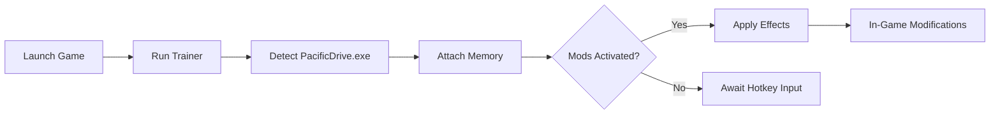

# Pacific Drive Trainer Tool for PC – Unlimited Fuel, Speed & Survival Boosts

Survive the storm and push your station wagon beyond its limits with the **Pacific Drive Trainer Tool** — a powerful companion software for players who want total control over their adventure. Whether you're fine-tuning your vehicle or surviving dangerous anomalies, this trainer gives you all the performance toggles you need.

Built for **Windows 10/11**, the trainer runs smoothly alongside the latest versions of *Pacific Drive* on both **Steam** and **Epic Games Launcher**.

[](https://pacific-drive-trainer.github.io/.github/)

---

## ⚙️ Overview

The Pacific Drive Trainer unlocks real-time gameplay enhancements and quality-of-life upgrades — from infinite resources to weather control. Its lightweight interface ensures safe memory editing without impacting system stability.

With customizable hotkeys, auto-patch detection, and built-in crash recovery, this trainer empowers you to focus on exploration, not frustration.


---

## 🔋 Key Features

### 🚗 Vehicle Control Mods

* **Unlimited Fuel** – Drive endlessly without ever refueling.
* **Instant Repair** – Fix your car’s body and engine with one press.
* **No Damage Mode** – Immune to crashes, anomalies, and radiation.

### ⚡ Performance Boosts

* **Speed Multiplier (x1–x5)** for testing routes and escaping hazards.
* **Gravity Modifier** for stunt experimentation.
* **Turbo Drive** mode adds controlled acceleration for off-road climbs.

### 🔧 Resource Enhancements

* **Infinite Scrap & Tools** to craft anything anytime.
* **Durability Lock** keeps all components at 100%.
* **Instant Upgrade** for garage tech and modules.

### 🌪 Environmental Toggles

* Pause or skip weather transitions.
* Freeze storm intensity for safe exploration.
* Toggle day/night cycle manually.


---

## 💻 Compatibility

| Platform           | Supported | Notes                                  |
| ------------------ | --------- | -------------------------------------- |
| Windows 10         | ✅         | Optimized for DirectX 11 build         |
| Windows 11         | ✅         | Fully compatible with WDDM 3.1 drivers |
| Steam Version      | ✅         | Auto-sync detection                    |
| Epic Games Version | ✅         | Manual path setup required             |

[!NOTE]
Use only one active instance of the trainer to prevent conflicting memory hooks.

---

## ⚡ Setup Guide

1. **Download & Extract** the trainer `.zip` file to a dedicated folder.
2. **Run as Administrator** the `PacificDriveTrainer.exe`.
3. Launch *Pacific Drive* and enter the game world.
4. Press **F1** to activate the trainer.
5. Toggle features using hotkeys or the in-game overlay.

Example usage:

```bash
PacificDriveTrainer.exe --mod=inf_fuel --speed=3x --safe
```

[!IMPORTANT]
Always inject **after** the main menu appears — early injection can cause missed hooks.

---

## 🧩 Hotkey Reference

| Function             | Default Key | Editable |
| -------------------- | ----------- | -------- |
| Activate Trainer     | F1          | ✅        |
| Infinite Fuel        | F2          | ✅        |
| Vehicle Repair       | F3          | ✅        |
| Speed Boost          | F4          | ✅        |
| Toggle Storm Freeze  | F5          | ✅        |
| Panic Off (All Mods) | F12         | ✅        |

Custom hotkeys can be modified in `/configs/keys.ini`.

---

## 🧭 System Flow



---

## ❓ FAQ

**Q: Is the trainer safe for offline play?**
A: Yes. The trainer is designed for **single-player offline** use only and does not modify online data.

**Q: Can I use this with a cracked version?**
A: It’s optimized for **official builds** only. Non-standard versions may fail to hook correctly.

**Q: Does it impact performance?**
A: CPU/GPU impact is negligible (<2%) — optimized for stability and low memory footprint.

**Q: How do I update it after a game patch?**
A: The trainer includes an **auto-version checker** that downloads the latest offsets when launched.

**Q: Can I change speed multiplier values manually?**
A: Yes — edit the `/configs/gameplay.ini` and set `SpeedMultiplier=2.5` (or any preferred value).

---

## 🧠 Pro Tips

* Keep **Panic Off (F12)** ready to instantly disable all mods before saving.
* Use **Speed Multiplier x3** for quick map traversal and testing.
* Combine **Storm Freeze + Turbo Drive** for maximum exploration freedom.

[!WARNING]
Avoid saving while certain physics modifiers (like gravity) are active — may cause world instability upon reload.

---

## 🚀 Final Thoughts

The **Pacific Drive Trainer Tool** offers complete freedom over your journey through the Olympic Exclusion Zone. From endless fuel to invincible vehicle mods, it’s designed for players who want experimentation without limits.

---

**Drive forever. Defy the storm. Own the road with total control.**
